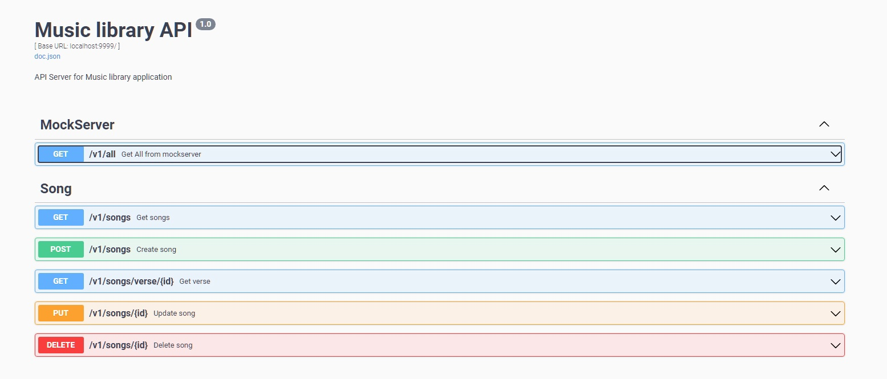

<div align="center">
    
    
</div>


# Music library test task
# REST API Server


This is Golang REST API server example including the following features:
*   based on minimalist Go web framework - [Echo](https://echo.labstack.com)
*   made with Clean Architecture (Controller => Service => Repository)
*   has services that work with  PostgreSQL database
*   config based on envconfig with [GoDotEnv](<https://github.com/joho/godotenv>)
*   fastest [Zap](<https://github.com/uber-go/zap>) logger
*   swagger documentation by [Swaggo](<https://github.com/swaggo/swag>)
* Implemented classic CRUD with all the requirements, including working with a third-party service when adding music to the library, [Mokky.dev](https://mokky.dev/) for example


##  [How to start project](#start)


1. to start correctly you will need [Docker](https://www.docker.com/products/docker-desktop/) and preferably "Make tools"
```sh
$ make up
```
or
```sh
$ docker compose -f docker-compose.yml up -d
```
2. After assembly, the server will start and Swagger documentation will become available to you at this path:
```sh
$ http://localhost:9999/swagger/
```

